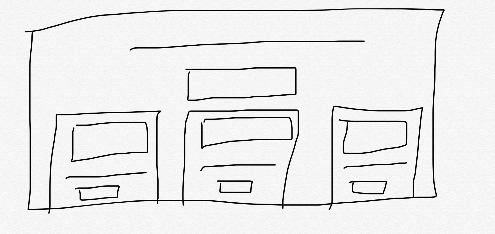
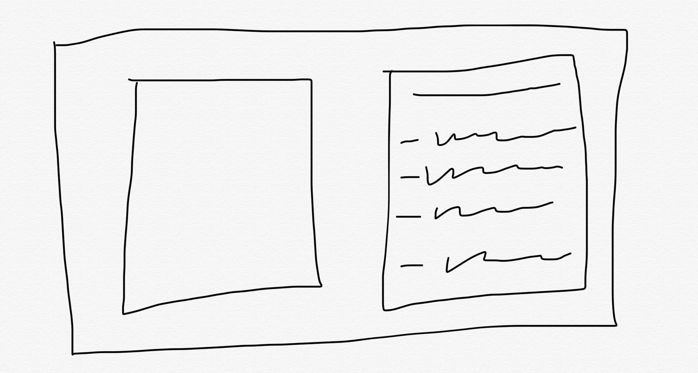

# Edible Adventures

Created by Maya Ramishun and Mohammed Kanoongo.

## 🚀 Mission statement

Our application, **Edible Adventures** is for **users who love making and eating new foods**. It allows users to **discover new recipes in any meal category**.

## API

This application will use the TheMealDB API. Below are the documentation and specific endpoints we intend to use.

- Link to API documentation: (https://www.themealdb.com/api.php)
- www.themealdb.com/api/json/v1/1/search.php?s=
  - Name of the meal
- www.themealdb.com/api/json/v1/1/random.php
  - None, generates a random meal.
- www.themealdb.com/api/json/v1/1/filter.php?i=
  Takes a main ingredient and fetches results.

[If your API requires an API key, say so here.]

## 👩‍💻 MVP User Stories

The core features of the application include:

- Users can search meals by name.
- Users can generate a random meal.
- Users can search for meals by main ingredient.

## 🤔 Stretch User Stories

If time permits, the following stretch features will be implemented in order of priority:

- Users will be able to view a video for each recipe.
- Users will be able to...
- Users will be able to...

## 📆 Timeline for reaching MVP in 1 week

To ensure that we can complete all core features of the application in 1 week, we will aim to complete tasks according to the following timeline:

**Day 1**

- [ ] Create Context (1 day)
- [ ] Finish README

**Day 2**

- [ ] Create components (2 days)
- [ ] User will be able to search meals by name (2 days)

**Day 3**

- [ ] User will be able to generate a random meal (2 days)
- [ ] User will be able to search for meals by main ingredient (1 day)

**Day 4**

- [ ] Experiment with non-submit events
- [ ] Use Link to help user navigate between pages

**Day 5**

- [ ] Styling and other misc items

## Wireframes of each page in your application

Below, you can find wireframes for our project. Each wireframe shows a different page of our application as well as the key components of the application. Details such as specific text values or images are intentionally not included:

